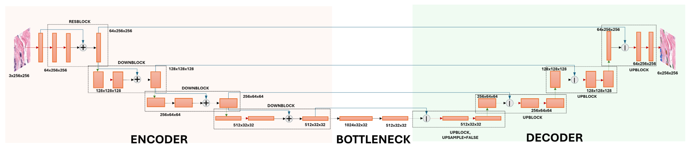
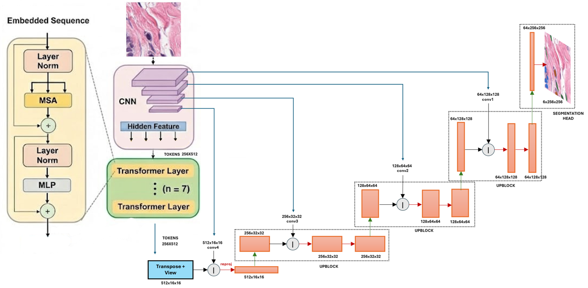

# PanNuke Nuclei Segmentation: ResNetUNet vs TransUNet

A comprehensive comparison of ResNetUNet and TransUNet architectures for multi-class nuclei segmentation on the PanNuke dataset, featuring rigorous statistical analysis and visualization.

## 📋 Table of Contents
- [Overview](#overview)
- [Dataset](#dataset)
- [Models](#models)
- [Results](#results)
- [Installation](#installation)
- [Usage](#usage)
- [Project Structure](#project-structure)
- [Configuration](#configuration)

## 🎯 Overview

This project implements and compares two state-of-the-art deep learning architectures for medical image segmentation:

- **ResNetUNet**: A CNN-based architecture combining ResNet backbone with U-Net decoder
- **TransUNet**: A hybrid CNN-Transformer architecture leveraging self-attention mechanisms

Both models are trained under identical conditions to segment **6 distinct classes** in histology images:
1. Neoplastic cells
2. Inflammatory cells  
3. Connective tissue cells
4. Dead cells
5. Epithelial cells
6. Background

The models contain roughly the same number of parameters (~25M) and are evaluated using:
- Dice Coefficient (per-class and mean)
- Paired t-tests for statistical significance
- False Discovery Rate (FDR) correction for multiple comparisons


*Figure 1: Dice coefficient metric used for evaluating segmentation quality*

## 📊 Dataset

### PanNuke Dataset
The PanNuke dataset consists of **7,904 histology images** (256×256 pixels) from 19 different tissue types, each with corresponding segmentation masks for 5 types of nuclei plus background.

**Dataset Split:**
- **Fold 1** (Training): 2,656 images (83 batches)
- **Fold 2** (Validation): 2,523 images (79 batches)
- **Fold 3** (Testing): 2,722 images (86 batches)

The notebook includes automated download and extraction from the official Warwick University repository.

### Data Augmentation
Training augmentations using Albumentations library:
- Random rotation (±360°, p=0.8)
- Horizontal flip (p=0.5)
- Vertical flip (p=0.5)
- Resize to 256×256 pixels
- Normalization to [0, 1]


## 🏗️ Models

### ResNetUNet Architecture
A fully convolutional architecture combining:
- **Encoder**: ResNet-inspired blocks with skip connections
- **Decoder**: Progressive upsampling with concatenated encoder features
- **Parameters**: ~25M trainable parameters

Key features:
- Batch normalization for training stability
- ReLU activation functions
- Skip connections for multi-scale feature fusion

### TransUNet Architecture  
A hybrid CNN-Transformer model featuring:
- **Patch Embedding**: Convolutional tokenization (16×16 patches)
- **Transformer Encoder**: 7 layers with 4 attention heads
- **CNN Decoder**: Progressive upsampling similar to U-Net
- **Parameters**: ~25M trainable parameters

Key features:
- Multi-head self-attention for global context
- Position embeddings for spatial information
- Layer normalization and dropout for regularization

### ResNetUNet Components

<p align="center" style="background-color: white; padding: 20px;">
  
</p>

*Figure 2: ResNetUNet complete architecture*


### TransUNet Components


*Figure 8: TransUNet hybrid CNN-Transformer architecture*


## 📈 Results

### Overall Performance

| Model | Mean Dice Score | Std Dev |
|-------|----------------|----------|
| **ResNetUNet** | 0.8390 | 0.1043 |
| **TransUNet** | 0.8410 | 0.1070 |

**Statistical Test (Paired t-test):**
- t-statistic: 2.4979
- p-value: 0.012550 *
- Mean difference: +0.0021 (in favor of TransUNet)
- **Conclusion**: TransUNet shows **statistically significant** improvement over ResNetUNet (p < 0.05)


### Per-Class Performance

| Class | ResNetUNet | TransUNet | Difference | p-value (FDR) | Significant |
|-------|-----------|-----------|------------|---------------|-------------|
| Background | 0.9637 ± 0.0293 | 0.9589 ± 0.0660 | -0.0047 | 0.000162 | ✓ |
| Neoplastic | 0.8431 ± 0.2145 | 0.8426 ± 0.2269 | -0.0004 | 1.000000 | ✗ |
| Inflammatory | 0.7452 ± 0.3257 | 0.7449 ± 0.3284 | -0.0004 | 1.000000 | ✗ |
| Connective | 0.6043 ± 0.3185 | 0.6061 ± 0.3217 | +0.0018 | 1.000000 | ✗ |
| Dead Cells | 0.9644 ± 0.1854 | 0.9644 ± 0.1854 | 0.0000 | 1.000000 | ✗ |
| Epithelial | 0.9131 ± 0.2203 | 0.9293 ± 0.1966 | +0.0162 | 0.000000 | ✓ |


### Training Curves


### Qualitative Results

The notebook includes qualitative visualization of predictions on challenging test samples, showing:
- Original histology images
- Ground truth segmentation masks
- ResNetUNet predictions with Dice scores
- TransUNet predictions with Dice scores


## 🚀 Installation

### Prerequisites
- Python 3.8+
- CUDA-capable GPU (recommended)
- 16GB+ RAM
- ~30GB disk space for dataset

### Setup

```bash
# Clone the repository
git clone https://github.com/yourusername/TransUNet.git
cd TransUNet

# Create virtual environment
python -m venv venv
source venv/bin/activate  # On Windows: venv\Scripts\activate

# Install dependencies
pip install torch torchvision
pip install numpy matplotlib tqdm
pip install albumentations opencv-python
pip install torchinfo scipy statsmodels pillow
```

## 📖 Usage

### Running the Complete Pipeline

Open and run `Pannuke Segmentation Notebook.ipynb` in Jupyter:

```bash
jupyter notebook "Pannuke Segmentation Notebook.ipynb"
```

The notebook is organized into sections:

1. **Data Download & Preparation** - Automated PanNuke dataset acquisition
2. **Configuration** - Hyperparameters and training settings
3. **Dataset & DataLoader** - PyTorch data pipeline with augmentation
4. **Model Definitions** - ResNetUNet and TransUNet architectures
5. **Training** - Model training with early stopping
6. **Evaluation** - Comprehensive metrics and visualizations
7. **Statistical Analysis** - Paired t-tests and significance testing


### Training from Scratch

The training process includes:
- SGD optimizer with momentum (0.9)
- Learning rate: 0.01
- Batch size: 32
- Early stopping (patience: 10 epochs)
- Combined Dice + Cross-Entropy loss

Training takes approximately XX hours on a single GPU.

## 📁 Project Structure

```
TransUNet/
├── Pannuke Segmentation Notebook.ipynb  # Main notebook
├── README.md                            # This file
├── data/                                # PanNuke dataset (auto-downloaded)
│   ├── fold1/
│   ├── fold2/
│   └── fold3/
├── weights/                             # Pre-trained model weights
│   ├── resNetUNet_best_model.pth
│   ├── resNetUNet_final_train.pth
│   ├── transUNet_best_model.pth
│   └── transUNet_final_train.pth
├── images/                              # Figures for README
│   └── *.png
└── IR project/                          # Separate IR project
    └── IR.ipynb
```

## ⚙️ Configuration

Key hyperparameters (modifiable in the `config` dictionary):

```python
config = {
    "image_size": 256,              # Input image dimensions
    "patch_size": 16,               # Transformer patch size
    "num_channels": 3,              # RGB channels
    "hidden_size": 512,             # Transformer embedding dim
    "num_attention_heads": 4,       # Multi-head attention
    "num_hidden_layers": 7,         # Transformer depth
    "num_classes": 6,               # Segmentation classes
    "batch_size": 32,               # Training batch size
    "num_epochs": 100,              # Maximum epochs
    "learning_rate": 0.01,          # Initial learning rate
    "momentum": 0.9,                # SGD momentum
    "patient": 10,                  # Early stopping patience
    "seed": 1234                    # Random seed
}
```

## 🔬 Key Findings

### Main Observations

1. **Overall Performance**: TransUNet achieved a slightly higher mean Dice score (0.8410) compared to ResNetUNet (0.8390), with a statistically significant improvement (p = 0.012550)
2. **Class-Specific Behavior**: 
   - **Background**: ResNetUNet performs significantly better (0.9637 vs 0.9589, p < 0.001)
   - **Epithelial**: TransUNet shows significant improvement (0.9293 vs 0.9131, p < 0.001)
   - **Other classes**: No significant differences (p > 0.05 after FDR correction)
3. **Statistical Significance**: After FDR correction, only Background and Epithelial classes show significant differences. The overall improvement of TransUNet is driven primarily by Epithelial cell segmentation
4. **Model Complexity**: Both models have ~25M parameters and similar computational requirements


## 📚 References

1. **PanNuke Dataset**: Gamper, J., et al. (2019). "PanNuke: An Open Pan-Cancer Histology Dataset for Nuclei Instance Segmentation and Classification." *MICCAI*
2. **TransUNet**: Chen, J., et al. (2021). "TransUNet: Transformers Make Strong Encoders for Medical Image Segmentation." *arXiv:2102.04306*
3. **U-Net**: Ronneberger, O., et al. (2015). "U-Net: Convolutional Networks for Biomedical Image Segmentation." *MICCAI*
4. **ResNet**: He, K., et al. (2016). "Deep Residual Learning for Image Recognition." *CVPR*


## 🤝 Contributing

Contributions are welcome! Please feel free to submit issues or pull requests for:
- Bug fixes
- Performance improvements
- Additional model architectures
- Extended evaluation metrics
